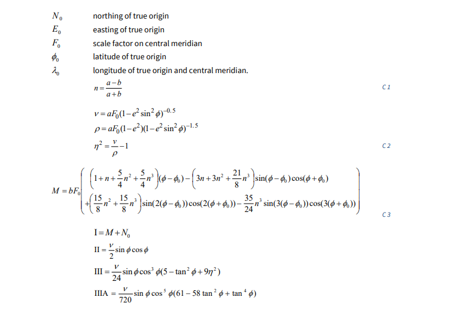

# Ordnance Survey Grid Refs in Golang

This is a Golang package to translate between Ordnance Survey (OS) Grid References and
Latitude / Longitude. OS Grid references are traditionally used in UK navigation, while
lat / lon is used by GPS systems and global mapping systems.

This package is a partial translation into Golang of the excellent
[Javascript library](https://github.com/chrisveness/geodesy) by Chris Veness.

## Quick start

```go
gridRef, err := ParseOsGridRef("SW 46760 28548")
if err != nil {
    panic(err)
}

lat, lon := gridRef.ToLatLon()
fmt.Printf("%.4f,%.4f\n", lat, lon)     // 50.1029,-5.5428
```
There are more detailed examples on [pkg.go.dev](
https://pkg.go.dev/github.com/paulcager/gosdata/osgrid#example-package).


---

## Q & A

### What's an OS Grid Reference? ##

The Ordnance Survey have been producing maps of Great Britain since
[1791](https://www.ordnancesurvey.co.uk/about/history). They use a
[National Grid](https://en.wikipedia.org/wiki/Ordnance_Survey_National_Grid) system, distinct
from latitude and longitude, where grid references comprise two letters and a sequence of
digits, such as "SK127836". Before smartphones with GPS became commonplace, OS grid references
were ubiquitous in the great outdoors - guide books would use them to tell you where to
park the car, hiking routes would be described using them, and should you get into trouble the
local Mountain Rescue team would want to know the location as an OS grid ref. 

So sometimes it is necessary to convert between OS grid refs and lat/lon references, such
as when providing a Google Maps link.

### How do you convert an OS Grid Reference? ##

It's difficult. Very, very difficult. Pages of this sort of stuff:


> (an excerpt from the Ordnance Survey's
[reference guide](https://www.ordnancesurvey.co.uk/documents/resources/guide-coordinate-systems-great-britain.pdf))

Fortunately Chris Veness has already done the hard work of implementing this in his
[Javascript library](https://github.com/chrisveness/geodesy) (which does much more than
just converting grid ref to and from lat/lon). This package is a fairly mechanical translation
of the Javascript into Golang, without understanding how it works.

### Why doesn't the code look like idiomatic Go? ###

This is deliberate, to make it easier to verify this implementation against the original
Javascript implementation. Where possible, each line of upstream code should match against
an equivalent line in the Golang code.

