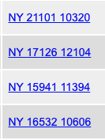
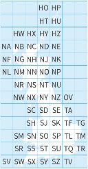

# Ordnance Survey Grid Refs in Golang

[](https://pkg.go.dev/github.com/paulcager/osgridref)
[](https://goreportcard.com/report/github.com/paulcager/osgridref)

A Golang package to convert between Ordnance Survey (OS) Grid References and Latitude/Longitude coordinates. OS Grid
references are traditionally used in UK navigation, while lat/lon is used by GPS systems and global mapping systems.

This package is a partial translation into Go of the
excellent [JavaScript geodesy library](https://github.com/chrisveness/geodesy) by Chris Veness.

## Table of Contents

- [Installation](#installation)
- [Quick Start](#quick-start)
- [Examples](#examples)
- [API Overview](#api-overview)
- [Q & A](#q--a)
    - [What's an OS Grid Reference?](#whats-an-os-grid-reference)
    - [What Does a Grid Reference Look Like?](#what-does-a-grid-reference-look-like)
    - [How do you convert an OS Grid Reference?](#how-do-you-convert-an-os-grid-reference)
    - [Why doesn't the code look like idiomatic Go?](#why-doesnt-the-code-look-like-idiomatic-go)
- [License](#license)
- [Contributing](#contributing)

## Installation

```bash
go get github.com/paulcager/osgridref
```

## Quick Start

### Convert OS Grid Reference to Latitude/Longitude

```go
package main

import (
	"fmt"
	"github.com/paulcager/osgridref"
)

func main() {
	// Parse an OS Grid Reference
	gridRef, err := osgridref.ParseOsGridRef("SW 46760 28548")
	if err != nil {
		panic(err)
	}

	// Convert to WGS84 lat/lon (used by GPS and Google Maps)
	lat, lon := gridRef.ToLatLon()
	fmt.Printf("%.4f,%.4f\n", lat, lon) // Output: 50.1029,-5.5428
}
```

### Convert Latitude/Longitude to OS Grid Reference

```go
package main

import (
	"fmt"
	"github.com/paulcager/osgridref"
)

func main() {
	// Create a lat/lon point (WGS84 datum)
	latLon := osgridref.LatLonEllipsoidalDatum{
		Lat:   50.1029,
		Lon:   -5.5428,
		Datum: osgridref.WGS84,
	}

	// Convert to OS Grid Reference
	gridRef := latLon.ToOsGridRef()
	fmt.Println(gridRef.String()) // Output: SW 4676 2854
}
```

## Examples

### Different Precision Levels

```go
gridRef, _ := osgridref.ParseOsGridRef("TG 51409 13177")

// 10-digit (1m precision)
fmt.Println(gridRef.StringN(10)) // TG 51409 13177

// 8-digit (10m precision)
fmt.Println(gridRef.StringN(8)) // TG 5140 1317

// 6-digit (100m precision)
fmt.Println(gridRef.StringN(6)) // TG 514 131

// Numeric format (full precision)
fmt.Println(gridRef.NumericString()) // 651409,313177
```

### Parse Different Formats

```go
// With spaces
ref1, _ := osgridref.ParseOsGridRef("TG 51409 13177")

// Without spaces
ref2, _ := osgridref.ParseOsGridRef("TG5140913177")

// Numeric format (easting, northing)
ref3, _ := osgridref.ParseOsGridRef("651409, 313177")

// Different precisions
ref4, _ := osgridref.ParseOsGridRef("TG 51 13") // 100m precision
ref5, _ := osgridref.ParseOsGridRef("TG 514 131") // 100m precision
ref6, _ := osgridref.ParseOsGridRef("TG 5140 1317") // 10m precision
```

### Working with Spherical Geodesy

```go
// Calculate distance between two points
cambridge := osgridref.LatLon{Lat: 52.205, Lon: 0.119}
paris := osgridref.LatLon{Lat: 48.857, Lon: 2.351}

distance := cambridge.DistanceTo(paris) // ~404,279 meters

// Calculate bearing
bearing := cambridge.InitialBearingTo(paris) // ~156.2°

// Find destination point
dest := cambridge.DestinationPoint(10000, 90) // 10km east
```

## API Overview

### Core Types

- **`OsGridRef`** - Represents an OS grid reference with Easting/Northing
- **`LatLon`** - Simple lat/lon on spherical earth model
- **`LatLonEllipsoidalDatum`** - Lat/lon with datum information (OSGB36, WGS84, etc.)

### Key Functions

#### OS Grid Reference Operations

- `ParseOsGridRef(string)` - Parse grid reference from string
- `OsGridRef.ToLatLon()` - Convert to WGS84 lat/lon
- `OsGridRef.String()` - Format as grid reference (8-digit)
- `OsGridRef.StringN(digits)` - Format with specified precision
- `OsGridRef.NumericString()` - Format as easting,northing

#### Datum Conversions

- `LatLonEllipsoidalDatum.ToOsGridRef()` - Convert lat/lon to grid reference
- `LatLonEllipsoidalDatum.ConvertDatum(toDatum)` - Transform between datums

#### Spherical Geodesy

- `LatLon.DistanceTo(point)` - Great circle distance
- `LatLon.InitialBearingTo(point)` - Initial bearing
- `LatLon.DestinationPoint(distance, bearing)` - Calculate destination
- `LatLon.Intersection(p1, brng1, p2, brng2)` - Find path intersection
- `AreaOf(polygon)` - Calculate area of spherical polygon

For complete documentation, see [pkg.go.dev](https://pkg.go.dev/github.com/paulcager/osgridref).

---

## Q & A

### What's an OS Grid Reference?



The Ordnance Survey have been producing maps of Great Britain
since [1791](https://www.ordnancesurvey.co.uk/about/history). They use
a [National Grid](https://en.wikipedia.org/wiki/Ordnance_Survey_National_Grid) system, distinct from latitude and
longitude, where grid references comprise two letters and a sequence of digits, such as "SK127836".

OS grid references are ubiquitous in the great outdoors - guide books use them to tell you where to park the car, hiking
routes use them, and should you get into trouble the local Mountain Rescue team would want to know the location as an OS
grid ref. However, the OS grid is only relevant in Great Britain; most electronic and global mapping systems instead use
Latitude and Longitude, as in, for example,
this [Google Maps URL](https://www.google.com/maps/place/51%C2%B030'11.9%22N+0%C2%B007'39.0%22W/).

So sometimes it is necessary to convert between OS grid refs and lat/lon references. This Go library can be used to
perform the conversion.

### What Does a Grid Reference Look Like?



The normal, human-readable representation is two letters followed by two groups of digits, for example `SZ 644 874`. The
2 letters define a 100 km by 100 km square, as in the diagram on the right. The first group of digits is the `eastings`
and the second is the `northings`; these digits define a coordinate _within_ the 100 km square.

An alternative notation is to omit the grid letters and provide just an `easting` and `northing` separated by a comma.
In this case these are coordinates relative to the _origin_ of the grid as a whole, i.e. relative to the south-west
corner of the grid.

The Ordnance Survey have created a
friendly [guide](https://getoutside.ordnancesurvey.co.uk/guides/beginners-guide-to-grid-references/) with full details.

This library can parse and display both types of representation.

### How do you convert an OS Grid Reference?

It's difficult. Very, very difficult. Pages of this sort of stuff:


> (an excerpt from page 50 of the Ordnance
> Survey's [reference guide](https://www.ordnancesurvey.co.uk/documents/resources/guide-coordinate-systems-great-britain.pdf))

Fortunately Chris Veness has already done the hard work of implementing this in
his [JavaScript library](https://github.com/chrisveness/geodesy) (which does much more than just converting grid ref to
and from lat/lon). This package is a fairly mechanical translation of the JavaScript into Go, without understanding how
it works.

I am pleased to say that I don't understand the mathematics behind any of this.

### Why doesn't the code look like idiomatic Go?

This is deliberate, to make it easier to verify this implementation against the original JavaScript implementation.
Where possible, each line of upstream code should match against an equivalent line in the Go code.

This means:

- Variable names follow JavaScript conventions
- Code structure mirrors the JavaScript source
- Comments are preserved from the original
- Greek letters (φ, λ, θ) are used for angles in radians

This approach makes it easier to:

1. Verify correctness against the JavaScript implementation
2. Port bug fixes from upstream
3. Understand the geodesy algorithms by comparing with the well-documented JavaScript source

## License

This package is licensed under the MIT License - see the [LICENSE](LICENSE) file for details.

The geodesy algorithms are based on formulas and JavaScript code © Chris Veness 2002-2020, also under the MIT License -
see [LICENSE.geodesy](LICENSE.geodesy).

## Contributing

Contributions are welcome! Please note:

- Bug fixes should be verified against the [original JavaScript library](https://github.com/chrisveness/geodesy)
- New features should maintain consistency with the JavaScript source where possible
- Code style intentionally mirrors JavaScript - see "Why doesn't the code look like idiomatic Go?" above
- Please add tests for any new functionality

For bug reports or feature requests, please [open an issue](https://github.com/paulcager/osgridref/issues).

## Acknowledgements

This package is a translation of Chris Veness's excellent [geodesy library](https://github.com/chrisveness/geodesy). All
geodetic formulae and algorithms are his work. Any errors in translation are mine.
